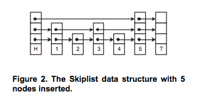
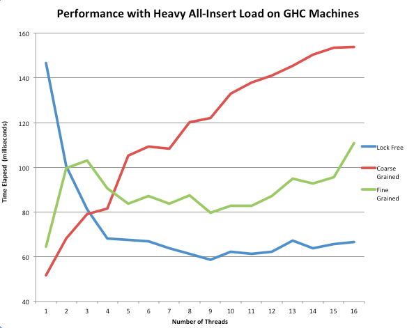
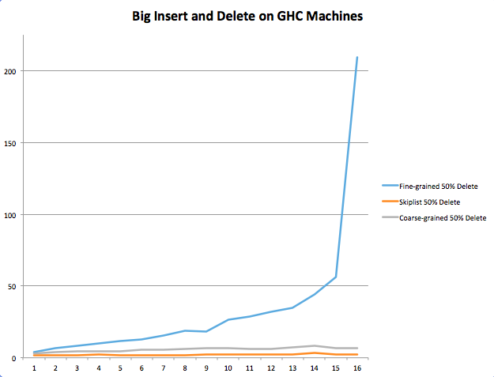
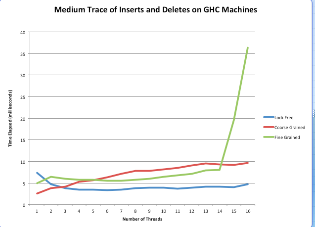
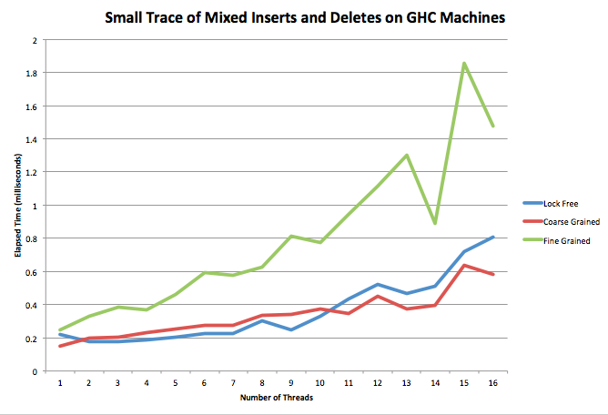
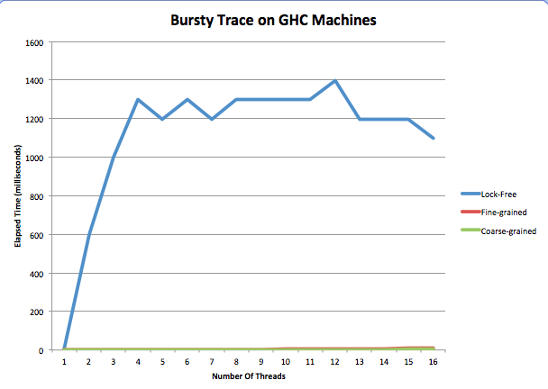

#PQ Unlocked: Lock-Free Priority Queue 

##Summary
We implemented a lock-free priority queue that is better than a fine-grained and coarse-grained priority queue for various high-contention traces using more than 3 threads. This includes traces with heavy insertion, deletion, and a mix of the operations. These traces were run on the GHC 8-core hyper-threaded machines. 

##Background
An effective concurrent priority queue should be able to quickly handle multiple simultaneous insert and deleteMin operations over a sustained period of time. This is cirtical for parallelized algorithms such as A* or Djikstra's as well as for the scheduler at the operating system level.

Traditional lock-based concurrent priority queues are implemented as heaps and rely primarily on lock-based mechanisms for synchronization. In particular, these locks can slow down insertion and deletion operations as they sift nodes up and down through the heap to maintain the heap invariant. The improved solution is to remove the overhead of obtaining and releasing mutexes and to use a data structure less prone to contention that heaps face.

In order to implement the lock-free PQ, a skiplist was used rather than the traditional heap data structure. We got this idea from the [paper cited in the Resources Section.] (http://www.non-blocking.com/download/SunT03_PQueue_TR.pdf) For benchmark purposes, our fine-grained and coarse-grained PQ's were implemented as traditional heaps. 

A skiplist lowers contention from multiple inserts and deletes for two main reasons. As a probabilistic data structure, simultaneous inserts have a high likelihood of happening at different levels of the skiplist and are less likely to manipulate the same pointers. Additionally, the delete operation always happens at the left-most tower of nodes.

The test harness that we developed simulated traces that consisted of a series of insertion and deletion requests with unique priorities. The output of this process was simply the resultant data structure which still contained any keys that had not been deleted yet.

The challenge with the work loads can arise when there are multiple insert/delete operations at the same time that can overwrite each other and corrupt the data structure. This lock-free program is dependent upon threads' careful maintenance of reference counts and delete markers to avoid corruption. While this adds overhead, the speedup was still found to be significant when scaling out to more threads.

##Assumptions and Constraints
* All unique priorities
* No DCAS
* Working on GHC machines
     * 8 cores
     * Hyperthreaded
     * 16 logical threads
* Workload has no notion of time
* Referencing Counting for Memory Management

##Implementation
We used the GHC machines to test our code for up to 16 logical threads and relied on standard C++ libraries. In particular, we made use of Boost in order to put threads to sleep as part of our general backoff strategy.

####Data Structure Choice
After doing some research, we felt that a heap was not naturally suited to a lock-free implementation. This is because the contention for certain pointers is so high on both insert and deleteMin. For example, inserting always causes contention for the pointer to the next empty space in the heap. Sifting up and down also causes a ton of contention. 

Instead, we chose to use a skiplist because its natural structure minimizes contention for insert, which happens to have the same expected time complexity as a heap's insert. It also provides an O(1) runtime for deletion, which beats the deleteMin runtime for heaps. For those unfamiliar with a skiplist, it can best be described as a linked list with multiple layers. See the figure below.

 

####Skiplist Insertion of Nodes 
Upon inserting a new node, we randomly choose a height for that node. We insert it into the linked list at that height and every level below it. Due to this probablistic approach, on each level there are half as many nodes as the level lower than it. So, on the bottom level there are 100% of the nodes, and at the next level up there are roughly 50% of them. 

Once we find the height, we begin looking for the place in which to place the node such that the PQ remains sorted. Since we start at some random height, chances are we won't need to look through all the nodes to find the place to insert the node. This is where the "skip" comes from in skiplist. The different levels allow one to skip forward during searching and inserting.  

This notion is most useful to us in the context of contention. In a skiplist, if we insert two nodes at the same time, they are more unlikely to access the same parts of the list at the same time. For example, if they are assigned different heights, it is much more unlikely the paths of inserting the two nodes will collide, whereas they collide every time in the heap. 

####Skiplist Deletion of Nodes
For delete, things get a bit more complicated. Managing all of the pointers and cases in which deleteMin and insert interrput the deleting thread was one of the hardest parts of this project. In general, when we are about to delete a node, we mark its value and its next pointer at each of its levels. This is to signal to all other threads that this node is "logically" deleted even though it is still physically in the list. We mark pointers by setting their least significant bit to one. We use this trick, learned from the paper referenced below, so that we do not need double compare and swap. 

Supposing no other threads preempt the deleting thread, the node becomes physically deleted when the next pointer of it's previous value points to its next node, just like in a regular linked list. 

Though, under situations of high contention and the use of many threads, the above situation is very unlikely. 

####Help Delete

We were inspired by the paper (reference again) to have threads that are inserting and deleting to aid other deleting threads. For example, let's say that you have the following situation. The stars mean we've marked the node's value and pointers to the next tower as ready to be deleted.

In a locking situation, the thread inserting the 3 would have to wait for the thread deleting 11 to be done. But, since this is lock-free, we want to avoid blocking everywhere we can. The inserting thread can detect if the node is being deleted by seeing if its values or pointers are marked. So, instead of having the thread inserting 3 wait, we instead have it help finish off deleting 3 from the current level down since the deleting thread deletes from the bottom of the tower to the top. The deleting thread is careful to check for this before it moves pointers around. We also have other deleting threads do this. If we call two deleteMin's in a row, they will both likely contribute to the deletion of the smallest element. 

We used the pseudo code in [this paper](http://www.non-blocking.com/download/SunT03_PQueue_TR.pdf) as a guide for our skiplist implementation. In addition, we modified the way we back off if we don't succeed in comparing and swapping. 

##Results

The results of our project met our expectations for outperforming traditional lock-based concurrent priority queues as well as lead to some interesting other avenues for further optimization.

To break down our analysis, we considered three different types of traces: insert only workloads, delete heavy operations, and equal probability of insert and delete operations. All traces began with an insertion of 100-1000 nodes before the series of insertions and deletes that were to be tested. 

We created a test harness that runs a suite of tests given a trace, number of threads, and number of iterations. It allows us to test multiple priority queue implementations in one call. For each priority queue implementation, we spin off the number of pthreads that correspond to the input number of threads and run the trace repeatedly for the number of iterations specified. In general we ran traces ten times per priority queue and took the average of their elapsed times in milliseconds. 

To generate traces, we wrote a python script that uses the random module to pick whether to insert or delete depending on the structure of the trace.  

Speedup was measured using CycleTimer to calculate the runtime of multiple iterations of the program at different thread counts. The curves provided below show this output for up to 16 threads.

This above figure shows 100,000 insert operations. As can be seen in the graph above, low thread counts reveal the relatively expensive overhead of a lock-free skiplist when no concurrency is needed. Repeated calls to atomic operations such as compare and swap slow down a program that would be performed better sequentially, as the coarse-grained heap performed better between 1 and 3 threads.

However, the performance curves were inverted at 16 running threads. The coarse-grained implementation steadily increased with a higher thread count. This was because the threads were constantly having to wait for the lock, degrading to what was similar to sequential operation. On other hand, the fine-grained implementation had significantly lower run time than coarse-grained as its hand-over-hand nature allows for more insert and delete operations simultaneously.

Finally, the biggest takeaway is that the lock-free skiplist implementation decreased in runtime until a scale up to 8 threads and then plateaued at a level much lower than that of either of the lock-based implementations. This is because in the lock-free implementation, all threads are constantly making progress in their insertions or deletions and are hindered only by short backoff periods. No spinning on locks or useless work is occurring. It was also interesting to note that this implementation used only a constant backoff strategies, as exponential backoff seemed to not change the runtime of the lockfree implementation much or even increase it.

In the above trace, we inserted 1000 nodes and then gave a 50% probability to insertion and deletion for 5000 operations. As you can see above, we found that lock-free still tended to perform better than the coarse-grained and fine-grained implementations. More specifically, fine-grained saw a spike at 14 threads, which we speculate is a result of the fact that the higher number of threads inserting and deleting in a relatively small priority queue increases contention to the point where runtime is drastically affected. At the same point, at 14 threads, the lock-free implementation continues to remain flat at an average runtime of 5 milliseconds.

One interesting thing to note is that coarse-grained appears to have been effective on this workload. We speculate that this is because each insertion and deletion operation is happening quickly enough that the global mutex is released with little hold time. This differs from fine-grained since that version is slowed down by any other insert or delete operations on the same heap, and there is a lot of overhead in locking and unlocking so many mutexes as opposed to just one.

We also ran our test suite on a medium trace (close to 1000 operations) and a small trace (close to 100 operations). 

The medium trace performs quite similarly to the large trace. However, in the small trace, the coarse-grained PQ actually beats the lock-free implementation past 10 threads. This could be due to the fact that when there are so few operations it is better to do them sequentially. The added time of comparing and swapping when there are many threads interacting actually goes against the lock-free implementation when the traces are really small. This slow down also could be due to threads helping the deletion process getting in the way.  

We can really see the negative performance of help delete in our final trace. This trace inserts 30 times, then deletes 30 times. It repeats this process ten times. 

We see that, for the first time, our lock-free implementation performs horribly. We believe that this is because all of the threads are in the middle of deleting when the next round of inserts starts, so they all begin helping delete instead of inserting anything. Not only does this happen on insert, but subsequent deleteMin operations also help each other delete. So, instead of deleting the node they were meant for, they help delete another thread's. In both cases, helping deletion delays the task the thread was set out to do constantly for this trace, and this causes massive slow down.

If we had more time, we would have like to remove the help delete from the skiplist to see how it did on the bursty trace. We also would have liked to explore more back off strategies because constant and sequential to see if we could get any further speedup. We also would have liked to run this on the latedays machines, so we should have asked for Boost on them sooner!

In conclusion, we were able to see our lock-free priority queue beat the other two implementations in most cases for a thread count greater than three. 

##Resources

The following white paper was used as reference material for the lock-free implementation. 
[Fast and Lock-Free Concurrent Priority Queues for Multi-Thread Systems by Hakan Sundell and Philippas Tsigas] (http://www.non-blocking.com/download/SunT03_PQueue_TR.pdf)

Additionally, to investigate different backoff strategies, the following paper was used.
[Lock-Free Linked Lists and Skip Lists by Mikhail Fomitchev and Eric Ruppert]

Finally, for the fine-grained priority queue, we used this book:
[The Art of Multiprocessor Programming by Maurice Herlihy and Nir Shavit]

##Link to Source Code
https://bitbucket.org/okelkar/finalproject/src

##Balanced Workload
Equal work was performed by both project members.

